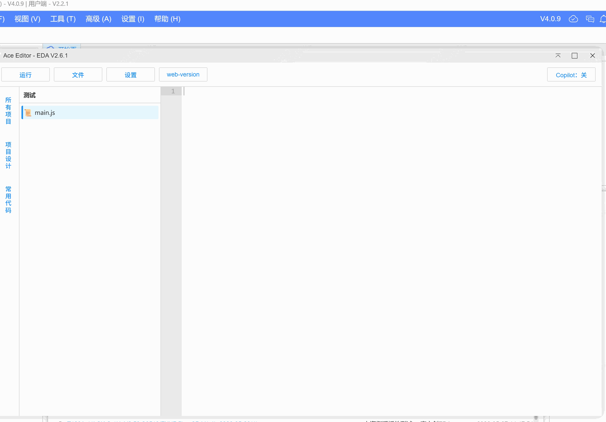
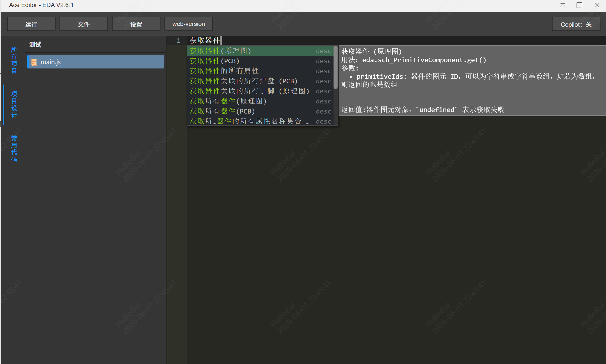
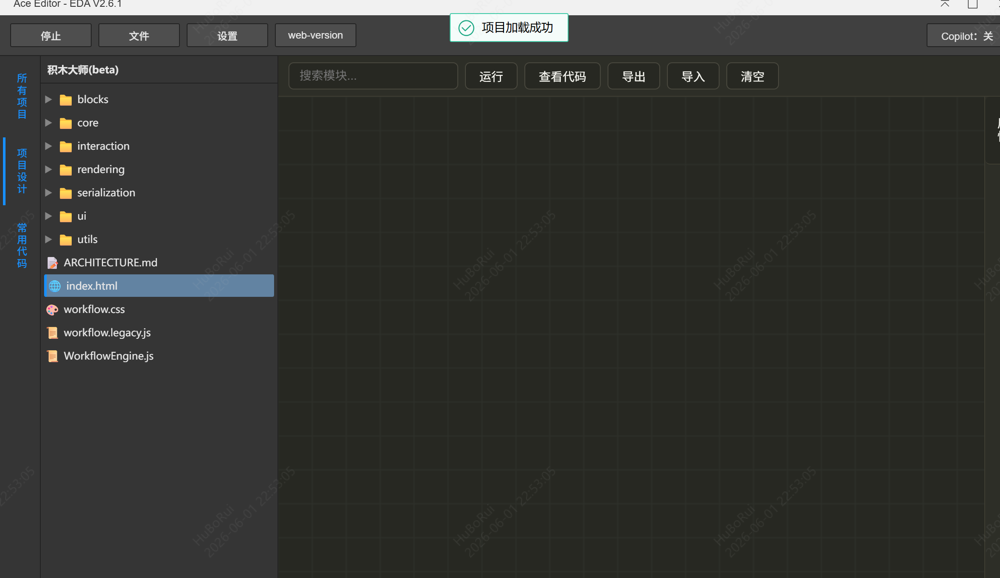
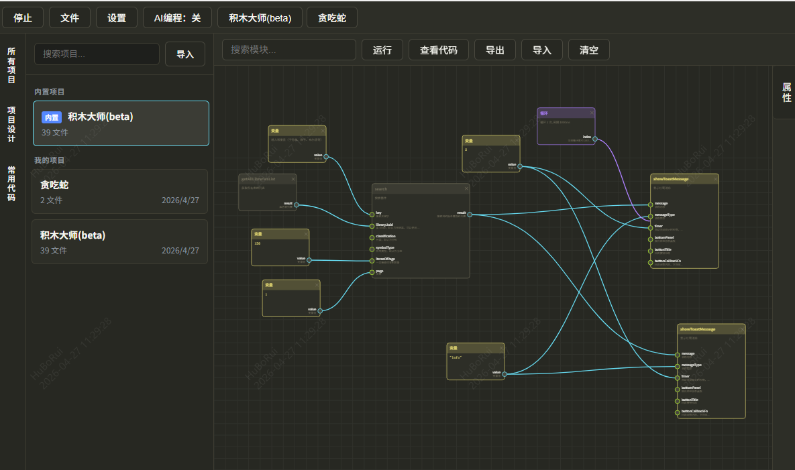

# Ace Code Editor for EDA Editing Evolution

[中文](./README.md)

A lightweight, embeddable JavaScript code editor built on [Ace Editor](https://ace.c9.io/), designed specifically for the **EasyEDA Pro** environment. Supports syntax highlighting, intelligent autocompletion, custom dictionaries, and one-click code execution.

---


## API Auto-Generated Test Cases



## API Auto-Distinguish PCB and Schematic



## Support Custom Completion & Edit Completion Parameters


## Three Built-in Styles and Custom Primitives


## HTML Online Preview with Path References



## A Brand New Workflow-Based Plugin Development Approach



## Features

- **Built-in themes and customization**: Primitive styles support customization, all colors can be switched
- **JavaScript syntax highlighting & intelligent autocompletion**
- **Top scrollable function sidebar** (reserved for future extensions)
- **Custom dictionary support**: Internal API can be injected for intelligent hints
- **Zero-dependency dynamic loading**: All resources are statically referenced, no network requests required
- **Responsive layout**: Adapted for iframe embedding scenarios

## Directory Structure

```
/iframe/
└── script/
    └── Ace_Editor/          # Ace core resources (must be deployed to this path)
        ├── ace.js
        ├── ext-language_tools.js
        ├── mode-javascript.js
        ├── theme-monokai.js
        └── worker-javascript.js (optional)
└── main/
    └── index.html           # Main page of this editor
```

Ensure that the `Ace_Editor/` folder has been fully uploaded to the `/iframe/script/` directory of the EDA server.

## Custom Dictionary (API Intelligent Hints)

Add custom completion rules in the initialization script of `index.html`:

```js
// Example: Add dictionary
editor.completers.push({
	getCompletions: function (editor, session, pos, prefix, callback) {
		var completions = [
			{ name: 'myFunction', value: 'myFunction', score: 1000, meta: 'custom' },
			// ... other completion items
		];
		callback(null, completions);
	},
});
```

Supports dynamic dictionary updates, suitable for internal SDKs or platform APIs.

## Open Source Dependencies

### Runtime Dependencies (distributed with the extension)

| Library                                                     | Version  | License                                   | Purpose                 |
| ----------------------------------------------------------- | -------- | ----------------------------------------- | ----------------------- |
| [Ace Editor](https://github.com/ajaxorg/ace)                | 1.36+    | BSD-3-Clause                              | Code editor core        |
| [SweetAlert2](https://github.com/sweetalert2/sweetalert2)   | 11.26.17 | MIT                                       | Modal dialogs           |
| [JSZip](https://github.com/Stuk/jszip)                      | 3.10.1   | MIT OR GPL-3.0-or-later (MIT chosen here) | Project import/export ZIP |
| [highlight.js](https://github.com/highlightjs/highlight.js) | 11.9.0   | BSD-3-Clause                              | AI chat code highlighting |
| [marked](https://github.com/markedjs/marked)                | 15.0.12  | MIT                                       | Markdown rendering      |
| [js-beautify](https://github.com/beautifier/js-beautify)    | —        | MIT                                       | Code formatting         |

### Development Dependencies (build-time only, not distributed with the extension)

| Library                                                                                          | Version  | License                              | Purpose                  |
| ------------------------------------------------------------------------------------------------ | -------- | ------------------------------------ | ------------------------ |
| [@jlceda/pro-api-types](https://www.npmjs.com/package/@jlceda/pro-api-types)                     | ^0.1.175 | Apache-2.0                           | EDA API type definitions |
| [TypeScript](https://github.com/microsoft/TypeScript)                                            | ^5.7.3   | Apache-2.0                           | Type checking & compilation |
| [esbuild](https://github.com/evanw/esbuild)                                                      | ^0.24.2  | MIT                                  | Bundling & building      |
| [ESLint](https://github.com/eslint/eslint)                                                       | ^8.57.0  | MIT                                  | Code linting             |
| [Prettier](https://github.com/prettier/prettier)                                                 | ^3.4.2   | MIT                                  | Code formatting          |
| [husky](https://github.com/typicode/husky)                                                       | ^9.1.7   | MIT                                  | Git hooks                |
| [lint-staged](https://github.com/lint-staged/lint-staged)                                        | ^15.3.0  | MIT                                  | Staged files checking    |
| [rimraf](https://github.com/isaacs/rimraf)                                                       | ^6.0.1   | ISC                                  | Cross-platform file cleanup |
| [ts-node](https://github.com/TypeStrong/ts-node)                                                 | ^10.9.2  | MIT                                  | TS script execution      |
| [fs-extra](https://github.com/jprichardson/node-fs-extra)                                        | ^11.3.0  | MIT                                  | Enhanced file operations |
| [JSZip](https://github.com/Stuk/jszip)                                                           | ^3.10.1  | MIT OR GPL-3.0-or-later (MIT chosen) | Build packaging          |
| [@microsoft/tsdoc](https://github.com/microsoft/tsdoc)                                           | ^0.15.1  | MIT                                  | TSDoc parsing            |
| [@trivago/prettier-plugin-sort-imports](https://github.com/trivago/prettier-plugin-sort-imports) | ^5.2.1   | Apache-2.0                           | Import sorting           |
| [ignore](https://github.com/kaelzhang/node-ignore)                                               | ^7.0.3   | MIT                                  | .gitignore rule parsing  |

### License Compliance

All dependencies use permissive open source licenses (MIT / BSD / Apache-2.0 / ISC). There are no GPL or other copyleft licenses with mandatory viral requirements.

JSZip uses a dual license `(MIT OR GPL-3.0-or-later)`, and this project chooses the MIT license.

## License

This project is released under the [Apache-2.0](LICENSE) license.
The UI and integration code may be freely used for internal development.

Made with ❤️ for EDA developers
Happy Coding!
