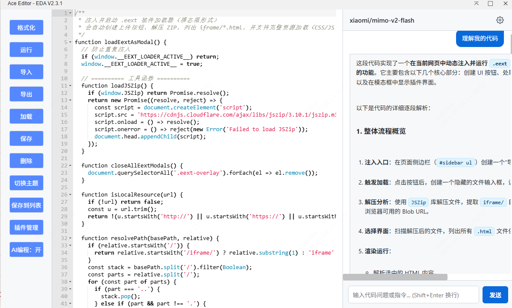
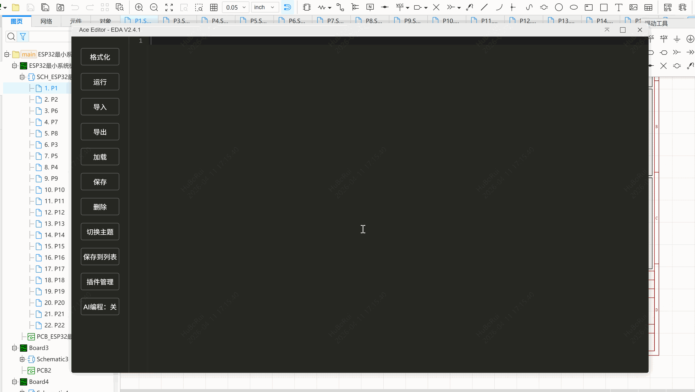
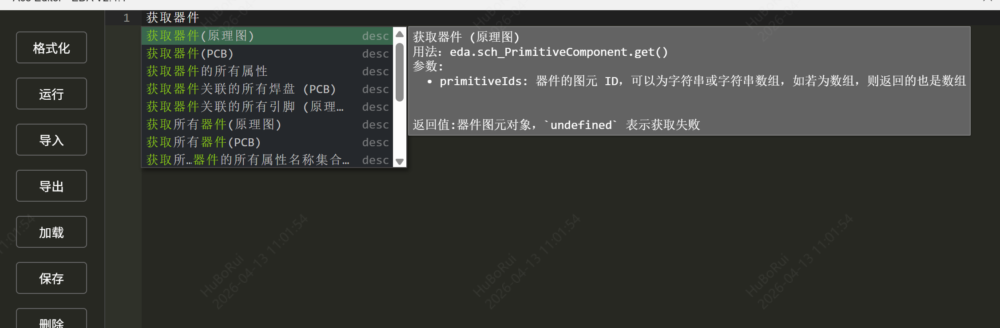

# Ace Code Editor for EDA 编辑进化

一个轻量级、可嵌入的 JavaScript 代码编辑器，基于 [Ace Editor](https://ace.c9.io/) 构建，专为 **嘉立创EDA（Embedded Development Assistant）** 环境设计。支持语法高亮、智能补全、自定义词库和一键运行代码。

---



## API自动生成测试用例



## API自动区分PCB和原理图



## 特性

- **Monokai 主题**：护眼暗色风格，与开发者习惯一致
- **JavaScript 语法高亮 & 智能补全**
- **左侧可滚动功能侧边栏**（预留扩展位）
- **自定义词库支持**：可注入内部 API 实现智能提示
- **零依赖动态加载**：所有资源静态引用，无需网络请求
- **响应式布局**：适配 iframe 嵌入场景

## 目录结构

```
/iframe/
└── script/
    └── Ace_Editor/          # Ace 核心资源（必须部署到此路径）
        ├── ace.js
        ├── ext-language_tools.js
        ├── mode-javascript.js
        ├── theme-monokai.js
        └── worker-javascript.js (可选)
└── main/
    └── index.html           # 本编辑器主页面
```

确保 `Ace_Editor/` 文件夹已完整上传至 EDA 服务器的 `/iframe/script/` 目录。

## 自定义词库（API 智能提示）

在 `index.html` 的初始化脚本中添加自定义补全规则：

```js
// 示例：添加词库
editor.completers.push({
	getCompletions: function (editor, session, pos, prefix, callback) {
		var completions = [
			{ name: 'myFunction', value: 'myFunction', score: 1000, meta: 'custom' },
			// ... 其他补全项
		];
		callback(null, completions);
	},
});
```

支持动态更新词库，适用于内部 SDK 或平台 API。

## 开发与扩展

### 添加新功能按钮

在左侧侧边栏动态插入按钮（可在编辑器中运行以下代码测试）：

```js
const li = document.createElement('li');
const btn = Object.assign(document.createElement('button'), {
	textContent: '保存',
	style: 'width:80px;height:36px;background:#272822;color:white;border:1px solid #666;border-radius:4px;font-size:14px;cursor:pointer;',
});
btn.onclick = () => eda.sys_Message.showToastMessage('假装保存了代码', 'info', 1);
document.querySelector('#sidebar ul').appendChild(li).appendChild(btn);
```

### 扩展建议

- 添加 **清空**、**格式化**、**导出** 按钮
- 集成 `localStorage` 实现代码自动保存
- 替换 `eval()` 为沙箱执行环境（如 `Function` 构造器）

## 注意事项

- **`eval()` 安全风险**：仅限可信环境使用（如内部 EDA 工具）
- **Worker 已禁用**：避免 EDA iframe 中的 CSP 限制问题
- **路径敏感**：资源路径必须为 `/iframe/script/Ace_Editor/xxx.js`（区分大小写）

## 许可证

本项目基于 [Ace Editor](https://github.com/ajaxorg/ace) 构建，遵循其开源协议（BSD License）。  
UI 和集成代码可自由用于内部开发。

Made with ❤️ for EDA developers  
Happy Coding!
