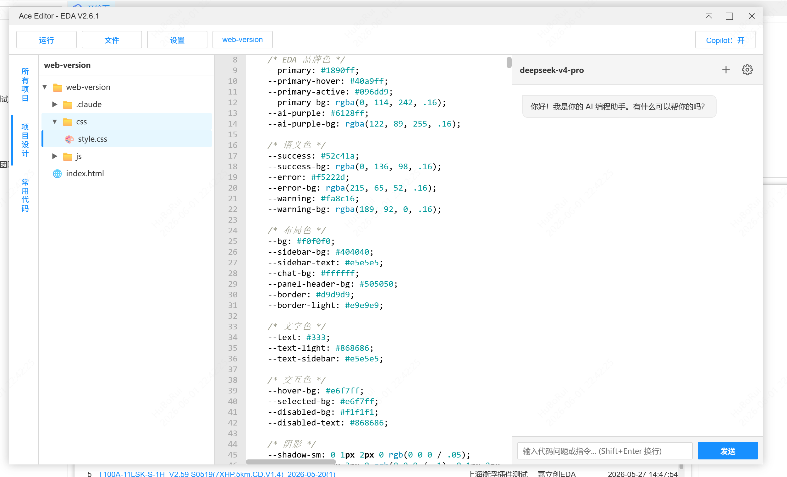
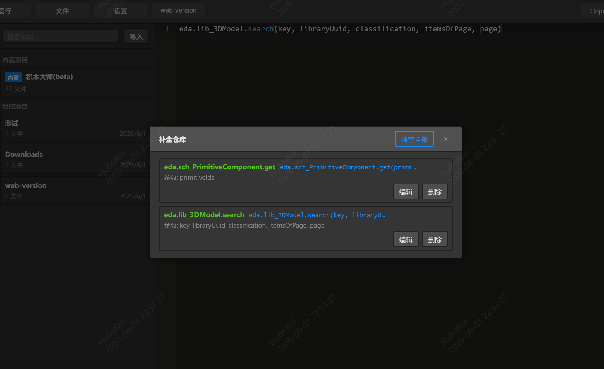
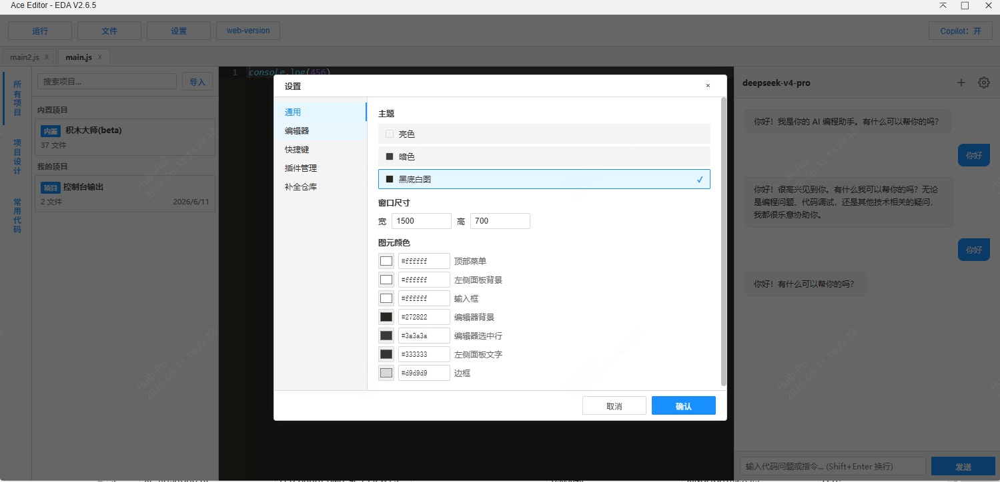
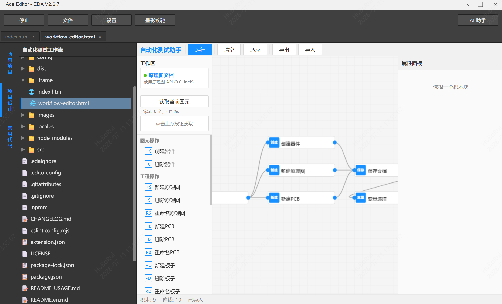
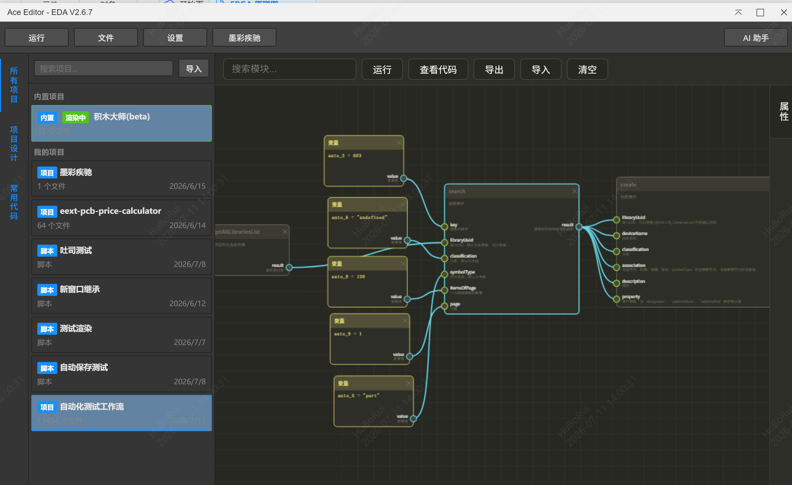

# Ace Code Editor for EDA 编辑进化

[English](./README.en.md)

一个轻量级、可嵌入的 JavaScript 代码编辑器，基于 [Ace Editor](https://ace.c9.io/) 构建，专为 **嘉立创EDA（EasyEDA Pro）** 环境设计。支持语法高亮、智能补全、自定义词库和一键运行代码。

---



## API自动生成测试用例


## API自动区分PCB和原理图


## 支持自定义补全 编辑补全参数



## 三套内置风格与自定义图元



## 带路径引用的html在线预览(支持在html内直接引入JS文件)



## 一种全新的基于工作流的插件开发方式



## 特性

- **内置主题与自定义**：图元风格支持自定义，各类颜色均支持切换
- **JavaScript 语法高亮 & 智能补全**
- **顶部可滚动功能侧边栏**（预留扩展位）
- **自定义词库支持**：可注入内部 API 实现智能提示
- **零依赖动态加载**：所有资源静态引用，无需网络请求
- **响应式布局**：适配 iframe 嵌入场景

## 目录结构

```
/iframe/
└── script/
    └── Ace_Editor/          # Ace 核心资源（必须部署到此路径）
        ├── ace.js
        ├── ext-language_tools.js
        ├── mode-javascript.js
        ├── theme-monokai.js
        └── worker-javascript.js (可选)
└── main/
    └── index.html           # 本编辑器主页面
```

确保 `Ace_Editor/` 文件夹已完整上传至 EDA 服务器的 `/iframe/script/` 目录。

## 自定义词库（API 智能提示）

在 `index.html` 的初始化脚本中添加自定义补全规则：

```js
// 示例：添加词库
editor.completers.push({
	getCompletions: function (editor, session, pos, prefix, callback) {
		var completions = [
			{ name: 'myFunction', value: 'myFunction', score: 1000, meta: 'custom' },
			// ... 其他补全项
		];
		callback(null, completions);
	},
});
```

支持动态更新词库，适用于内部 SDK 或平台 API。

## 开源依赖

### 运行时依赖（随扩展分发）

| 库                                                          | 版本     | 许可证                                    | 用途              |
| ----------------------------------------------------------- | -------- | ----------------------------------------- | ----------------- |
| [Ace Editor](https://github.com/ajaxorg/ace)                | 1.36+    | BSD-3-Clause                              | 代码编辑器核心    |
| [SweetAlert2](https://github.com/sweetalert2/sweetalert2)   | 11.26.17 | MIT                                       | 模态对话框        |
| [JSZip](https://github.com/Stuk/jszip)                      | 3.10.1   | MIT OR GPL-3.0-or-later（本项目选用 MIT） | 项目导入/导出 ZIP |
| [highlight.js](https://github.com/highlightjs/highlight.js) | 11.9.0   | BSD-3-Clause                              | AI 聊天代码高亮   |
| [marked](https://github.com/markedjs/marked)                | 15.0.12  | MIT                                       | Markdown 渲染     |
| [js-beautify](https://github.com/beautifier/js-beautify)    | —        | MIT                                       | 代码格式化        |

### 开发依赖（仅构建时使用，不随扩展分发）

| 库                                                                                               | 版本     | 许可证                              | 用途                |
| ------------------------------------------------------------------------------------------------ | -------- | ----------------------------------- | ------------------- |
| [@jlceda/pro-api-types](https://www.npmjs.com/package/@jlceda/pro-api-types)                     | ^0.1.175 | Apache-2.0                          | EDA API 类型定义    |
| [TypeScript](https://github.com/microsoft/TypeScript)                                            | ^5.7.3   | Apache-2.0                          | 类型检查与编译      |
| [esbuild](https://github.com/evanw/esbuild)                                                      | ^0.24.2  | MIT                                 | 打包构建            |
| [ESLint](https://github.com/eslint/eslint)                                                       | ^8.57.0  | MIT                                 | 代码检查            |
| [Prettier](https://github.com/prettier/prettier)                                                 | ^3.4.2   | MIT                                 | 代码格式化          |
| [husky](https://github.com/typicode/husky)                                                       | ^9.1.7   | MIT                                 | Git hooks           |
| [lint-staged](https://github.com/lint-staged/lint-staged)                                        | ^15.3.0  | MIT                                 | 暂存区检查          |
| [rimraf](https://github.com/isaacs/rimraf)                                                       | ^6.0.1   | ISC                                 | 跨平台文件清理      |
| [ts-node](https://github.com/TypeStrong/ts-node)                                                 | ^10.9.2  | MIT                                 | TS 脚本执行         |
| [fs-extra](https://github.com/jprichardson/node-fs-extra)                                        | ^11.3.0  | MIT                                 | 文件操作增强        |
| [JSZip](https://github.com/Stuk/jszip)                                                           | ^3.10.1  | MIT OR GPL-3.0-or-later（选用 MIT） | 构建打包            |
| [@microsoft/tsdoc](https://github.com/microsoft/tsdoc)                                           | ^0.15.1  | MIT                                 | TSDoc 解析          |
| [@trivago/prettier-plugin-sort-imports](https://github.com/trivago/prettier-plugin-sort-imports) | ^5.2.1   | Apache-2.0                          | import 排序         |
| [ignore](https://github.com/kaelzhang/node-ignore)                                               | ^7.0.3   | MIT                                 | .gitignore 规则解析 |

### 许可证合规性

所有依赖均采用宽松的开源许可证（MIT / BSD / Apache-2.0 / ISC），不存在 GPL 或其他 Copyleft 强制传染性许可证。

JSZip 采用双许可证 `(MIT OR GPL-3.0-or-later)`，本项目选用 MIT 许可证。

## 许可证

本项目基于 [Apache-2.0](LICENSE) 许可证发布。
UI 和集成代码可自由用于内部开发。

Made with ❤️ for EDA developers
Happy Coding!
